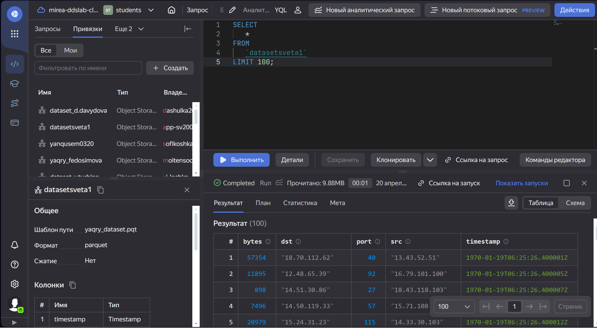

# Применение технологий искусственного интеллекта и машинного обучения
для поиска угроз информационной безопасности
Kabanova Svetlana

# Лабораторная работа №1

Использование технологии Yandex Query для анализа данных сетевой
активности

## Цель работы

1\. Изучить возможности технологии Yandex Query для анализа
структурированных наборов данных

2\. Получить навыки построения аналитического пайплайна для анализа
данных с помощью сервисов Yandex Cloud

3\. Закрепить практические навыки использования SQL для анализа данных
сетевой активности в сегментированной корпоративной сети

## Ход работы

#### 1. Доступность данных в Yandex Object Storage

Проверьте доступность данных (файл yaqry_dataset.pqt) в бакете
arrow-datasets S3 хранилища Yandex Object Storage. Проверить можно
просто перейдя по правильно сконструированному URL в браузере.

https://storage.yandexcloud.net/arrow-datasets/yaqry_dataset.pqt

#### 2. Подключить бакет как источник данных для Yandex Query

Yandex Query – это облачное решение для анализа данных, в котором задачи
организации хранения, обеспечения доступа и выполнения первичного
анализа данных полностью берет на себя сервис-провайдер, то есть Yandex
Cloud.

2.1 Создадим соединение для бакета в S3 хранилище

2.2 Заполняем поля с учетом допустимых символов, выбираем тип
аутентификации. Вводим имя бакета в соответствующее поле и сохраняем

2.3. Укажем какой объект использовать в качестве источника данных. Для
этого нужно сделать привязку данных.

2.4. Настройка привязки данных

Описание состава и формата входных данных

Формат данных SCHEMA=( timestamp TIMESTAMP NOT NULL, src STRING, dst
STRING, port INT32, bytes INT32 )

Если настройка выполнена правильно, то получится выполнить аналитический
запрос. Результат должен быть непустым

#### Анализ

1\. Известно, что IP адреса внутренней сети начинаются с октетов
принадлежащих интервалу \[12-14\]. Определите количество хостов
внутренней сети, представленных в датасете.

2\. Определите суммарный объем исходящего трафика

3\. Определите суммарный объем входящего трафика
